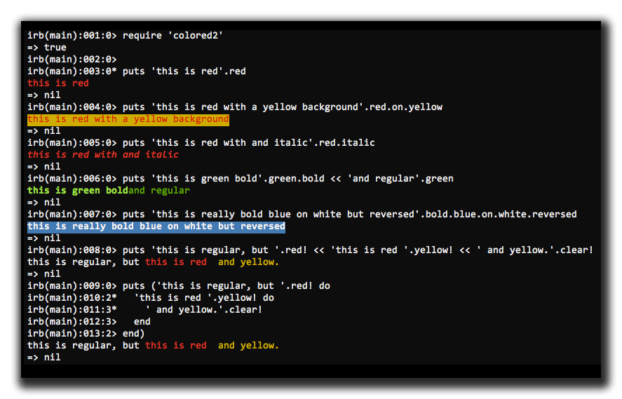
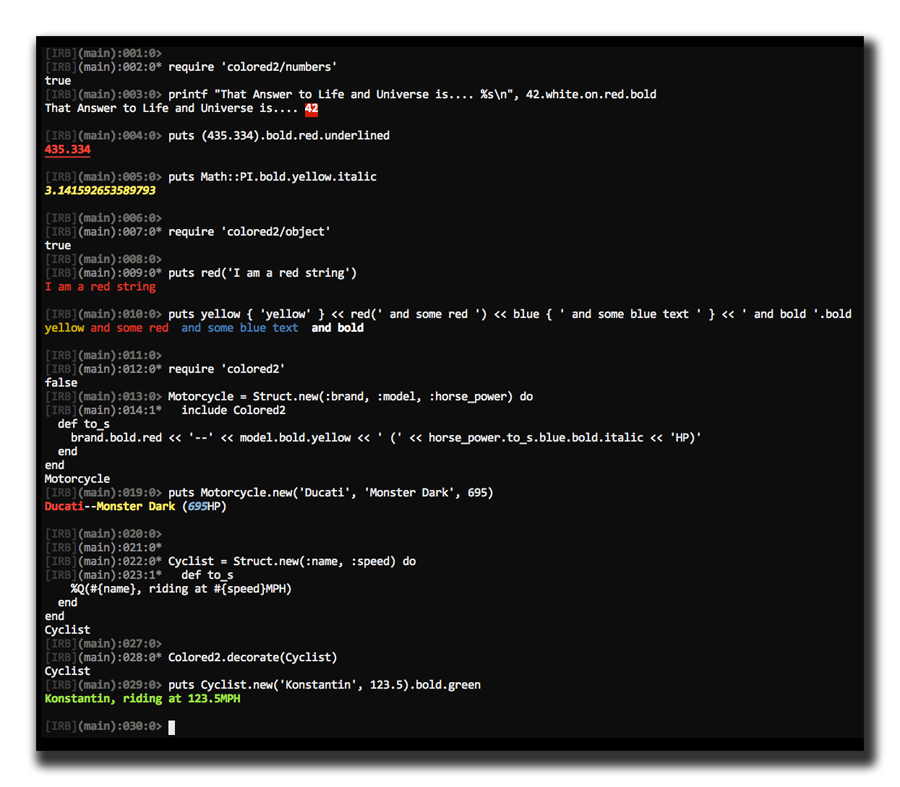

[](https://badge.fury.io/rb/colored2)
[](https://travis-ci.org/kigster/colored2)
[](https://codeclimate.com/repos/56dff58d80b254164b003d80/feed)
[](https://codeclimate.com/repos/56dff58d80b254164b003d80/coverage)
[](https://codeclimate.com/repos/56dff58d80b254164b003d80/feed)

## Colored2

This is a fork of Chris (defunkt) Wanstrath's colored gem, which appears to be no longer supported.

This fork comes with a slightly spruced up syntax and RSPec.

## Usage

In addition to the simple syntax of the original gem, which affected only the string to the left of the method call, 
the "bang" syntax affects a string to the right. If the block or a method argument is provided,
the contents is wrapped in the color, and the color is then reset back. If no block
or argument is provided, the color is left open-ended, and must be explicitly reset – when using the 'bang' notation.



### Complete set of colors:

 * black
 * red
 * green
 * yellow
 * blue
 * magenta
 * cyan
 * white

### Complete Set of Effects

 * no_color
 * bold
 * dark
 * italic
 * underlined
 * reversed 
 * plain
 * normal   
 
## Usage in Other Classes

You can decorate and color not just strings. 

To color numbers, require the following file, which automatically decorates `Fixnum` and `Float`.  You can also add color methods to the `Object`. Finally, you can add the methods to any custom class by including the `Colored2` Module.

Below is an `IRB` — session that shows a slightly more advanced usage.



##  Additional Helpers

There are several additional helpers tucked onto the `String` class.

 * `#to_bol` (to beginning of the line) will rewind the cursor back to the beginning of the current line.
 * `#to_eol` (to end of line)
 
## Installation

Add this line to your application's Gemfile:

```ruby
    gem 'active_feed'
```

And then execute:

    $ bundle

Or install it yourself as:

    $ gem install active_feed


## Development

To install this gem onto your local machine, run `bundle exec rake install`. To release a new version, update the version number in `version.rb`, and then run `bundle exec rake release`, which will create a git tag for the version, push git commits and tags, and push the `.gem` file to [rubygems.org](https://rubygems.org).

## Contributing

Bug reports and pull requests are welcome on GitHub at [https://github.com/kigster/colored2](https://github.com/kigster/colored2).

## License

The gem is available as open source under the terms of the [MIT License](http://opensource.org/licenses/MIT).
